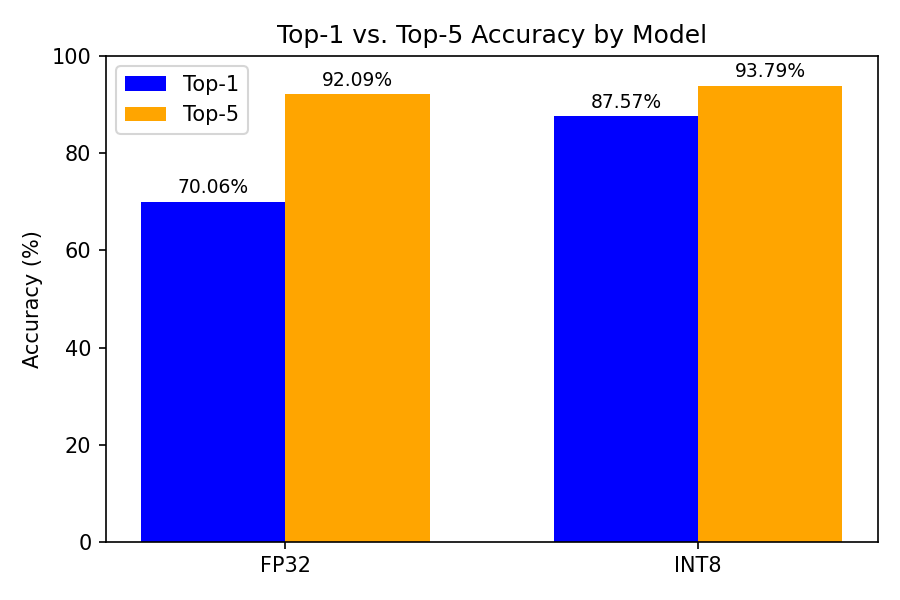
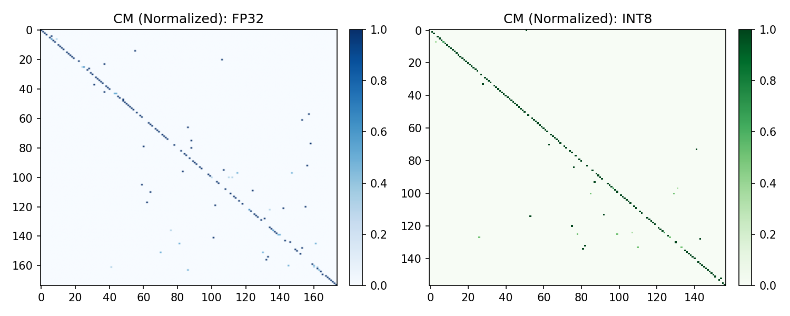
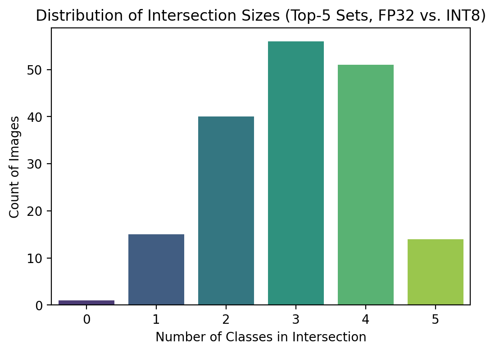
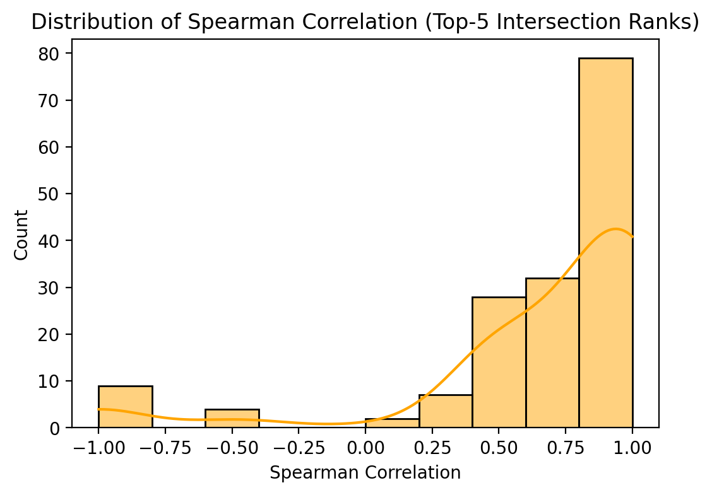
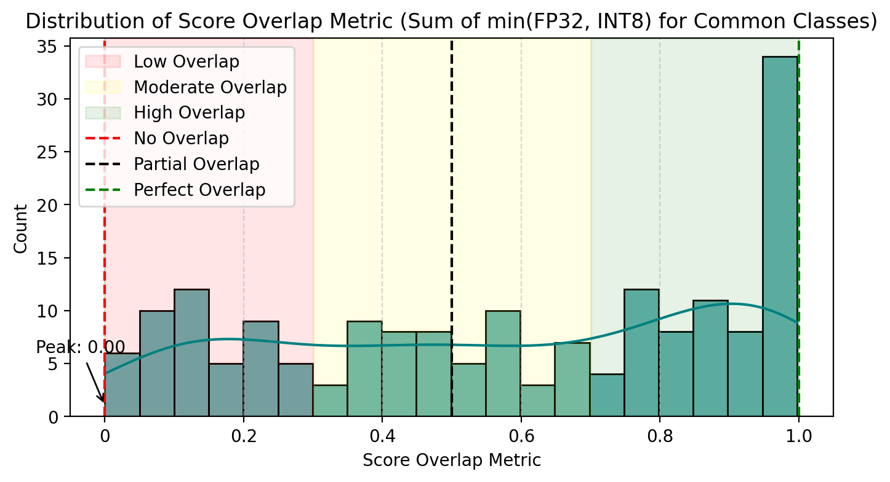

# Deploying and Optimizing Deep Learning Models for Edge Inference on FPGA Platforms

This repository summarizes a research project focused on deploying and optimizing deep learning models, specifically a ResNet-based neural network, for efficient edge inference on FPGA platforms. The work leverages **Xilinx Vitis AI 3.0** and a **Xilinx ZCU104** evaluation board to investigate INT8 quantization, balancing model accuracy with power and latency constraints crucial for TinyML applications.

## Project Overview

The project explores the practical deployment of quantized convolutional neural networks (CNNs) on the Xilinx ZCU104 FPGA board. It addresses the growing need for TinyML solutions that bring AI capabilities to resource-constrained edge devices, offering benefits like real-time performance, reduced latency, and lower power consumption compared to traditional CPU/GPU-based inference.

**Key Goals:**
*   Investigate methods to quantize a ResNet-based neural network to INT8 precision.
*   Deploy the quantized model on the Xilinx ZCU104 FPGA using Vitis AI.
*   Evaluate the performance (accuracy, latency, throughput, energy efficiency) of the FPGA-accelerated model.
*   Establish a reproducible workflow for edge AI deployment on FPGAs.

**Keywords:** TinyML, Edge Inference, FPGA, Vitis AI, Quantization, Deep Learning, ResNet, WSL2, Docker.

## Methodology

The project followed a structured workflow, encompassing environment setup, model preparation, quantization, hardware-centric compilation, and on-target inference and evaluation.

### 1. Environment Setup
The development environment was configured on a Windows host system leveraging:
*   **Windows Subsystem for Linux 2 (WSL2)** with **Ubuntu 20.04**.
*   **Docker Desktop** integrated with WSL2 for containerized and reproducible builds.
*   **Xilinx Vitis AI 3.0 Docker Images**:
    *   CPU-only image (`xilinx/vitis-ai-pytorch-cpu:latest`) for model compilation.
    *   GPU-accelerated image (`xilinx/vitis-ai-pytorch-gpu:latest`) for quantization, utilizing an NVIDIA GPU with the **NVIDIA Container Toolkit** for passthrough.

### 2. Model and Dataset Preparation
*   **Model Selection**: **ResNet18** was chosen for its balance between accuracy and computational efficiency, suitable for FPGA constraints.
*   **Dataset**: An **ImageNet 1000 mini** dataset (from Kaggle) was used for training, validation, and testing, structured for PyTorch's `ImageFolder`. Subsets were used for faster calibration during quantization.

### 3. Quantization Workflow (FP32 to INT8)
The Vitis AI Quantizer was used within a Python script (`resnet18_quant.py`) for the following stages:
1.  **Calibration**: A subset of the validation dataset was used to observe activation ranges and determine scaling factors for INT8 conversion. This generated quantization parameters (`Quant_info.json`) and an intermediate quantized model.
2.  **Quantized Model Accuracy Evaluation**: The INT8 model was evaluated on the full validation set to assess accuracy post-quantization.
3.  **Deployable Model Export**: The final INT8 model was exported as a `.xmodel` file (e.g., `resnet18_pt.xmodel`), a hardware-agnostic format for the Vitis AI compiler.

### 4. Model Compilation and Deployment Preparation
*   **Hardware-Specific Compilation**: The Vitis AI Compiler (`vai_c_xir`) translated the quantized `.xmodel` into a deployable DPU (Deep Learning Processing Unit) executable specific to the ZCU104's DPU architecture (DPUCZDX8G).
*   **Configuration File**: A `.prototxt` file was created, containing metadata for the Vitis AI runtime (e.g., preprocessing parameters, model type, post-processing settings).
*   **Transfer to Target**: The compiled `.xmodel` and `.prototxt` files were transferred to the ZCU104 board using `scp`.

### 5. Inference and Performance Evaluation on ZCU104
*   **Target Environment**: Test images/videos were transferred to the ZCU104.
*   **Execution**: Sample C++ applications from the Vitis AI Library were compiled and run on the ZCU104 to perform inference with the deployed `resnet18_pt` model.
*   **Performance Metrics**: Latency (ms/image), throughput (fps), and energy consumption (Joules/image) were measured.

## Tools and Technologies
*   **Hardware**: Xilinx ZCU104 Evaluation Board (with Zynq UltraScale+ MPSoC)
*   **AI Development Toolkit**: Xilinx Vitis AI 3.0
*   **Deep Learning Model**: ResNet18
*   **Quantization**: INT8 post-training quantization
*   **Frameworks/Libraries**: PyTorch
*   **Development Environment**:
    *   Windows Subsystem for Linux 2 (WSL2)
    *   Ubuntu 20.04
    *   Docker
    *   NVIDIA CUDA Toolkit & NVIDIA Container Toolkit (for GPU-accelerated quantization)
*   **Dataset**: ImageNet 1000 mini

## Results and Discussion

### Accuracy Analysis
Quantization from FP32 to INT8 precision yielded interesting results for the ResNet18 model:

*   **Top-1 Accuracy**:
    *   FP32 Baseline: 70.06%
    *   INT8 Quantized: **87.57%**
*   **Top-5 Accuracy**:
    *   FP32 Baseline: 92.09%
    *   INT8 Quantized: **93.79%**

This counter-intuitive improvement in Top-1 accuracy for the INT8 model suggests that quantization might act as a form of regularization or benefit from specific numerical properties in this context.

*Figure 1: Comparison of ResNet18 Top-1 and Top-5 accuracies for FP32 and INT8 models.*

Normalized confusion matrices for both models showed strong diagonal performance, with the INT8 model potentially exhibiting slightly less off-diagonal scattering, aligning with its improved accuracy.

*Figure 2: Normalized confusion matrices for FP32 (left) vs. INT8 (right) models.*

### Prediction Consistency Analysis
To understand the impact of quantization on prediction behavior beyond aggregate accuracy:

*   **Top-5 Prediction Set Overlap**: The majority of test images shared 3, 4, or all 5 classes in their top-5 predictions between the FP32 and INT8 models, indicating high similarity in the predicted sets.
    
    *Figure 3: Distribution of intersection sizes for the top-5 prediction sets between FP32 and INT8 models.*

*   **Top-5 Prediction Rank Stability**: Spearman rank correlation for common classes within the top-5 predictions was strongly skewed towards +1.0, suggesting that the INT8 model largely maintained the relative ranking of predictions from the FP32 model.
    
    *Figure 4: Distribution of Spearman rank correlation for common classes in top-5 predictions.*

### Performance on ZCU104 (DPUCZDX8G @ 300 MHz, Batch Size 1)

The INT8-quantized ResNet-18 model demonstrated efficient performance on the ZCU104's DPU:

| Precision           | DPU Cores | Latency (ms/image) | Throughput (fps) | Energy / Image (Joules) |
|---------------------|-----------|--------------------|------------------|-------------------------|
| **INT8**            | **1**     | **7.6 ms**         | **131 fps**      | **~0.038 J**            |
| **INT8**            | **2**     | **3.6 ms**         | **281 fps**      | **~0.036 J**            |
| FP32 (ARM CPU est.) | N/A (CPU) | ~50 ms*            | ~20 fps*         | ~0.35 J*                |

*<small>\*Estimated from typical Cortex-A53 performance for comparison.</small>*

These results highlight:
*   Significant acceleration using the FPGA's DPUs compared to estimated CPU performance.
*   Effective parallel processing capability when using dual DPU cores.
*   Low energy consumption per inference, crucial for edge applications (estimated operational power draw of 5W).

### Qualitative Observations and Confidence Score Analysis
*   **Deployment Experience**: While initial board boot and model loading have overhead, subsequent inference is highly efficient.
*   **Thermal Behavior**: The ZCU104 maintained stable operating temperatures during continuous inference, assuming adequate cooling.
*   **Confidence Score Overlap**: The distribution of confidence score overlap between FP32 and INT8 models showed a concentration towards higher values, but also a spread, indicating that while predicted classes often matched, confidence levels could diverge more significantly for a subset of images.
    
    *Figure 5: Distribution of Score Overlap Metric between FP32 and INT8 models.*

## Conclusion

This project successfully demonstrated the end-to-end deployment and optimization of a ResNet18 deep learning model on a Xilinx ZCU104 FPGA platform using Vitis AI 3.0. Key achievements include:

*   **Effective INT8 Quantization**: The ResNet18 model was quantized to INT8, surprisingly leading to an improvement in Top-1 accuracy (from 70.06% to 87.57%) while maintaining high Top-5 accuracy and prediction consistency.
*   **Efficient FPGA Inference**: The quantized model achieved high throughput (up to 281 fps with dual DPUs) and low latency (as low as 3.6 ms) with significantly reduced energy consumption (~0.036 J/image) on the FPGA.
*   **Reproducible Workflow**: A robust development workflow was established using WSL2, Docker, and the Vitis AI toolchain, highlighting the importance of containerization and structured methodologies for edge AI development.
